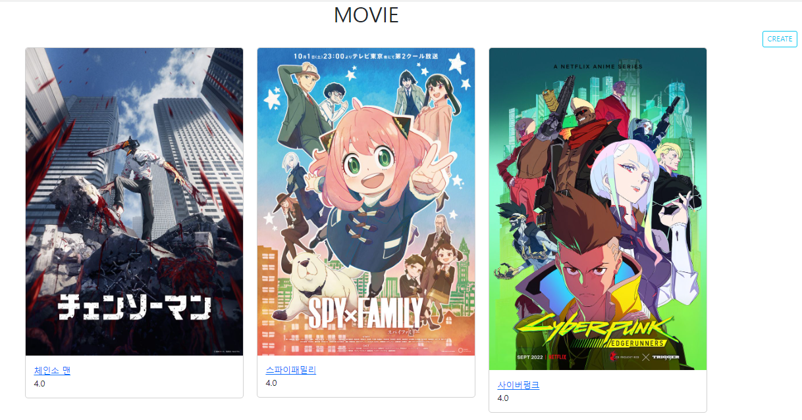
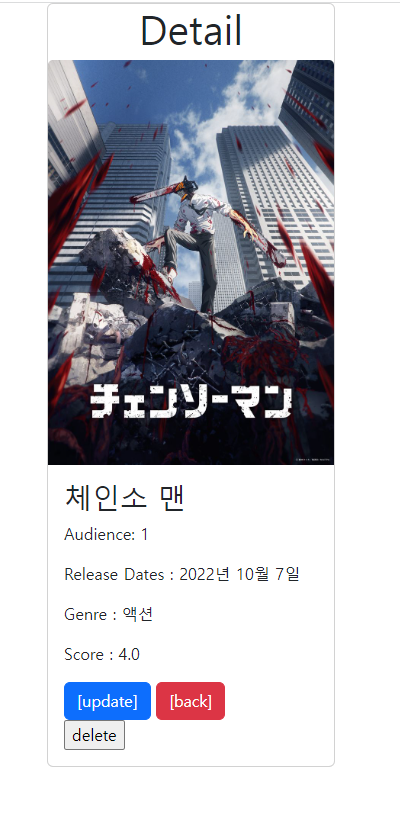
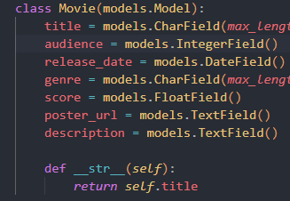
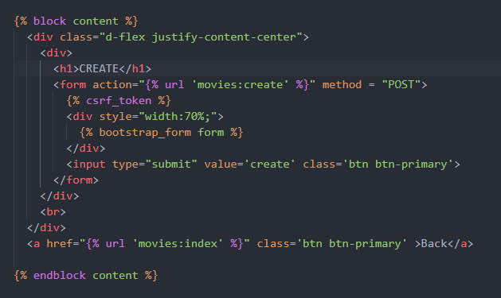
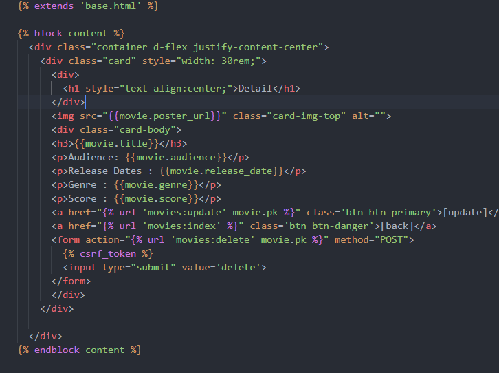
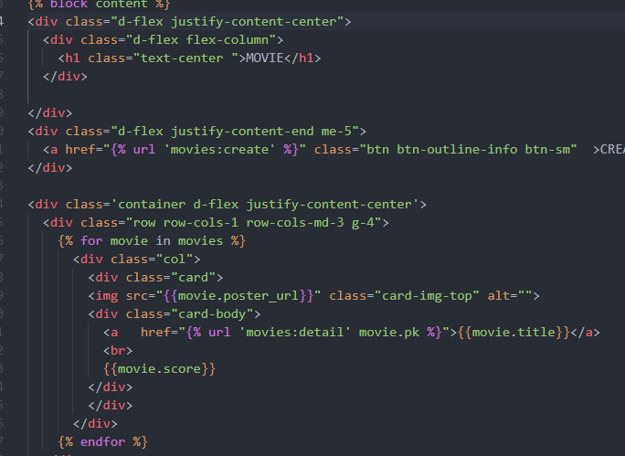
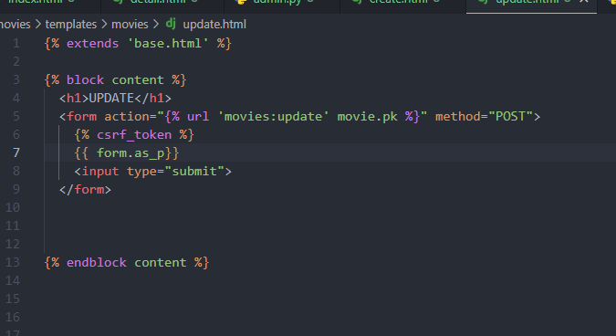

```markdown
python -m venv venv
interpreter 파이썬 선택
껏다키고
pip install django==3.2.13 장고설치
pip freeze > requirements.txt
django-admin startproject pjt . #프로젝트 생성
django-admin startapp articles #앱생성


setting.py에 앱이름 등록
dir에 base.html 설정

```









- 모델들을 저장해준다 



​		부트스트랩 로드를 사용해서 form 을 설정해준다 




detail 의 각 정보를 넣어주고 

부트스트랩으로 꾸며주었다 




인덱스 페이지

for문을 사용해서 카드를 정렬 해주었다 


