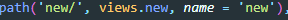

가상환경 실행

```bash
python -m venv venv
interpreter 파이썬 선택
껏다키고
pip install django==3.2.13 장고설치
pip freeze > requirements.txt
django-admin startproject pjt . #프로젝트 생성
django-admin startapp articles #앱생성


setting.py에 앱이름 등록
dir에 base.html 설정
```


- 먼저 모델에 필드명과 데이터 유형을 넣어준다.

  


''인 이유는 /moves 에서 바로 인데스를 보여주기위해서 , views. 의 뒤에오는게 views에 있는 함수를 실행시킨

​	 

경로를 설정해주기위해 movies.urls파일로 가게 해준다.

그리고 이건 쳐다도 안본다.

먼저 admin사이트에 로그인해준다 

```bash
$ python manage.py createsuperuser
```


--------------------------------------------------------------------------------------------------------------------------------------------------------

index.html


```django
 url 'movies:new' urls.py에서 new 라는 함
```

변수값이 영화 제목이고  이버튼을 누르면 movies:detail 로 가는 urls 이다 그뒤에 pk값을 설정해줘서 1,2,3 에맞는걸로 간다


movies는 무엇이 들었나

movies값을 context에 담아주어서  index.html을 불러준다. (그중에 타이틀값을 제목으로 설정한거임)

그럼이제 클릭하면 나올 detail 페이지를 알아보자.

---

detail.html


각 항목에 맞는 {{ 벨류 }} 값을 표시해주었다.

```django
'movies:edit' edit urls로 가라는뜻 movie.pk 에 맞는 값으로 
```

```django
movies:delete pk값을 가지고 delete urls로 간다.
```

나중에 후술


pk값을 가져와서 context로 전달한다


---

new.html


action= 'movies:create' 데이터를 보내준다.

입력값들을 보내줌 

select에는 for문으로 장르들의 값들을 넣어주었다 .




create 함수는 


각 title, audience 등등 값들을 가져와서 post로 값들을 넣어주고 

movie.save로 저장해준다

그값들을 movies:detail에 넣어줌 pk값을 가지고


---

edit,update,delete


고유값 pk 경로로 


update로 해당 pk값에 맞춰서


- 데이터저장 형태를 어떻게할지 설정하겠다. → `Model`
- 유저에게 보여지는 화면을 고치고 싶다. → `Template`
- 데이터를 처리해서 가공하고 싶다. → `View`
- 가공한 데이터를 유저가 보는 화면으로 넘겨주고 싶다. → URLconf

