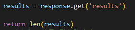
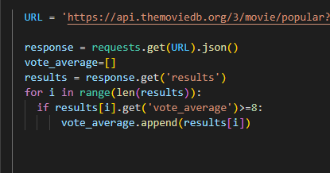
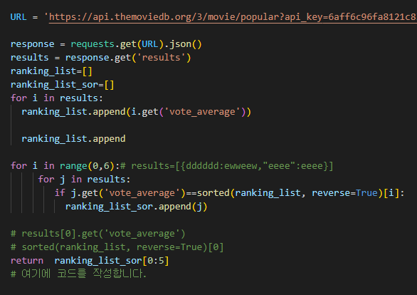
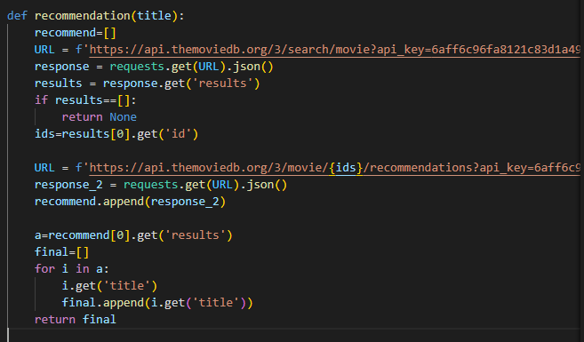
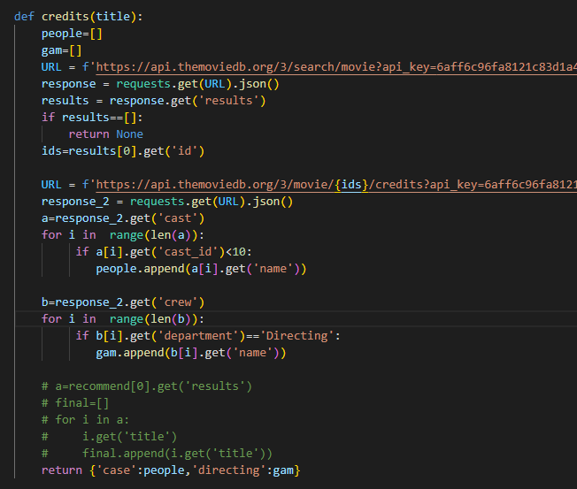

# A. 인기 영화 조회

```python
URL = 'https://api.themoviedb.org/3/movie/popular?api_key=6aff6c96fa8121c83d1a49c01d1407b3&language=ko-KR&page=1'
response = requests.get(URL).json()
```

- api를 가져오는법이다



마무리는 이렇게 

# B. 특정 조건에 맞는 인기 영화 조회 



'vote_average'의 값이 8이상 인 영화를 찾아야 한다 어떻게 할까.

1. vote_average가 8이상인것을 찾는다
2. 그 찾은 리스트값의 인덱스 값을 알아내서 빈리스트에 추가 시킨다

전체 길이를 순회하는 for문을 작성한후 vote_average 값이 8이상 만족시킨것을 찾아 리스트에 추가했다

# C. 특정 조건에 맞는 인기 영화 조회2



1. i.get('vote_average')는 평점값들이다 이것을 모아준다
2. 맨 처음 for문 제일 적게 돌리는거를 쓰자 (평점 5개만 필요하니깐 5개만 한다)
3. 하나의 평점에대해서 모든 results 값들을 돌려서 맞는거 하나를 찾는다
4. 찾은거를 빈 리스트 안에 넣어준다

- 2중 for 문 누구를 i , j로 할것인지 잘생각하자 
- 마지막 슬라이스를 넣은 이유는 평점이 같은 얘들이 있기 때문이다.

# D. 



1. api 값이 필요한 부분에 f spring 을 f.{}
2. results 값이 비어있으면 None 반환
3. ids=results 의 맨처음 id 값

ids의 api 접속해서 또 찾아준다음에 리스트에 넣어준다

a 에 results 값을 넣고 

- a의 for문을 돌려서 title 값을 다찾아낸다음에 
- final에 다넣어준다

# E.



맨처음 for 문 만 알면 쉽다

```python
for i in  range(len(a)):     # a 문 [{},{},{}...]의 길이만큼
         if a[i].get('cast_id')<10: # i에 해당하는 cast의 값이 10보다 작으면
            people.append(a[i].get('name')) # 그 i에 'name'의 값을 추가해준다
           # people은 빈리스트임
```

